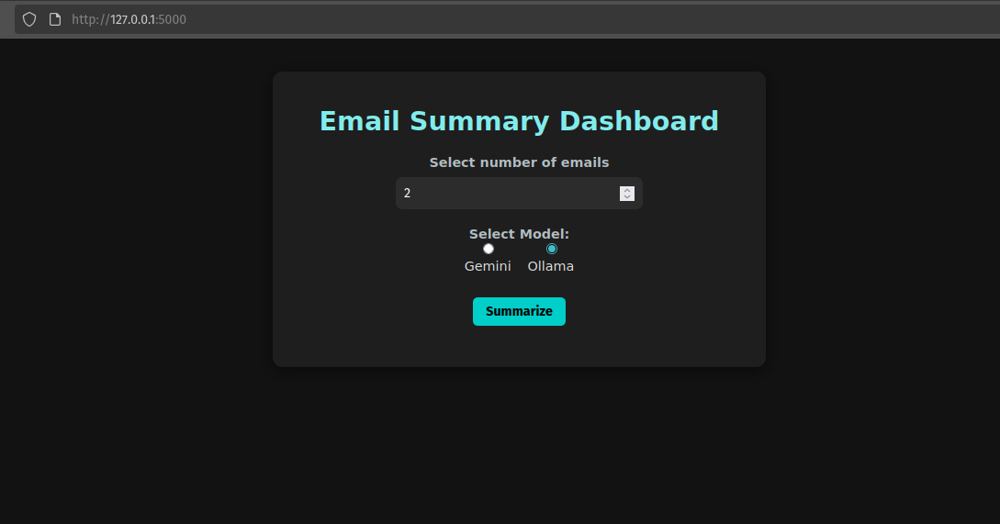
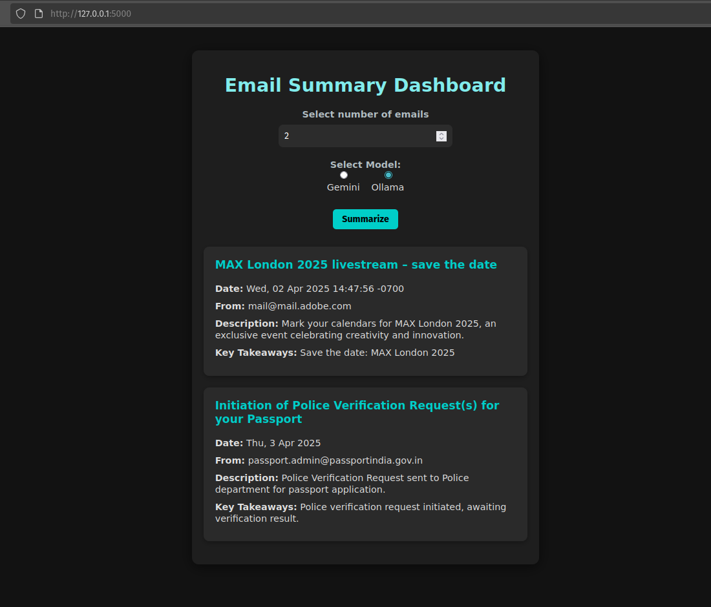
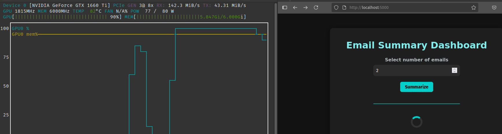

# 📬 Email Summarizer Dashboard

A responsive dashboard for summarizing your recent emails using either Gemini 2.0 Flash or Ollama. You can choose the number of emails to fetch and have them summarized one by one.

## Important Considerations

- The **free** Gemini API key offers **faster** summarization but at the cost of your privacy.
- Ollama models enable a fully local experience, although processing speeds depend on your hardware.

 



---


## Prerequisites

Create a `.env` file in the **root directory** with the following contents:

```env
EMAIL_USERNAME = <your_email@example.com>
EMAIL_PASSWORD = <your_email_app_password>
IMAP_SERVER = imap.gmail.com
GEMINI_API_KEY = <your_google_gemini_api_key>
```

ℹ️ The email password should be an **App Password**, which you can generate in your email provider’s security settings (e.g., [Google App Passwords](https://myaccount.google.com/apppasswords)).

### Popular IMAP Servers

Here is a list of popular IMAP servers for common email providers:

- **Gmail:** `imap.gmail.com` 
- **Outlook.com/Hotmail:** `imap-mail.outlook.com` 
- **Yahoo! Mail:** `imap.mail.yahoo.com` 
- **iCloud Mail:** `imap.mail.me.com` 
- **AOL Mail:** `imap.aol.com` 

🧠 The Gemini API key is **free** and can be generated from [Google AI Studio](https://aistudio.google.com/app/apikey). It is mandatory if you wish to use Gemini!

💻 To use Ollama, download it from [ollama.com](https://ollama.com/download) and download recommended model such as `llama3.2:1b` ([ollama.com/models](https://ollama.com/library/llama3.2:1b)).


---

## Setup Instructions

1. **Clone this repository:**

   ```bash
   git clone https://github.com/vishruth555/mailBrief.git
   cd mailBrief
   ```

2. **Install dependencies:**

   ```bash
   pip install -r requirements.txt
   ```

3. **Add your credentials to `.env` as shown above.**

4. **Run the server:**

   ```bash
   python run.py
   ```

5. **Access the dashboard at:**

   ```
   http://127.0.0.1:5000/
   ```

---

## 🚀 Running with Docker

### 

1. **Clone this repository:**

   ```bash
   git clone https://github.com/vishruth555/mailBrief.git
   cd mailBrief
   ```

2. **📦 Build the run Docker Image**

   ```bash
   docker build -t mailbrief .
   docker run -d mailbrief
   ```


## Notes

- Uses **Gemini 2.0 Flash** via API for rapid summarization.
- **Ollama** models offer a local processing alternative. Note that summarization speed depends on your hardware. For sensitive data (e.g., company mail accounts), local processing is recommended.
- Configure your Ollama model in `app/services/lllm.py`.
- The default model is `llama3.2:1b` (1.3GB).
- The default context length is set to 8192, which should run on most systems.

---

## Performance

Here's the GPU performance with a 32k context length:



## License

MIT License

---

## Contributing

Pull requests and issues are welcome.