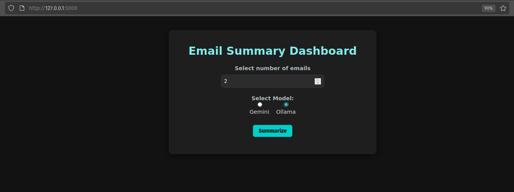
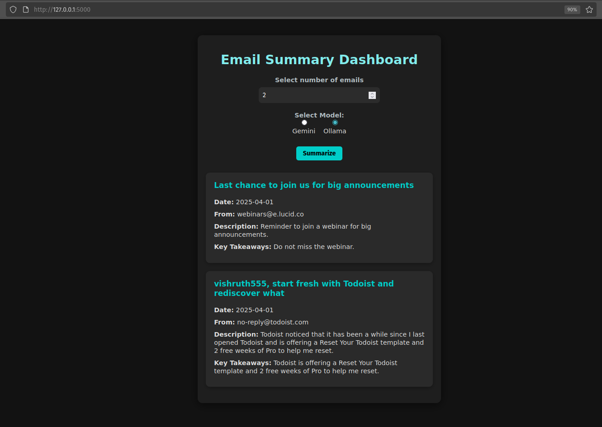

# 📬 Email Summarizer Dashboard

A responsive dashboard for summarizing your recent emails using either Gemini 2.0 Flash or Ollama. You can choose the number of emails to fetch and have them summarized one by one.

## Important Considerations

- The **free** Gemini API key offers **faster** summarization but at the cost of your privacy.
- Ollama models enable a fully local experience, although processing speeds depend on your hardware.

 



---


## Prerequisites

Create a `.env` file in the **root directory** with the following contents:

```env
EMAIL_USERNAME = '<your_email@example.com>'
EMAIL_PASSWORD = '<your_email_app_password>'
IMAP_SERVER = '<imap.gmail.com>'
GEMINI_API_KEY = '<your_google_gemini_api_key>'
```

ℹ️ The email password should be an **App Password**, which you can generate in your email provider’s security settings (e.g., [Google App Passwords](https://myaccount.google.com/apppasswords)).

🧠 The Gemini API key is **free** and can be generated from [Google AI Studio](https://aistudio.google.com/app/apikey).

Either the Gemini API key must be set in your environment variables (.env file) or Ollama must be installed and running. The recommended model is *llama 3.2:latest*.

---

## Setup Instructions

1. **Clone this repository:**

   ```bash
   git clone https://github.com/vishruth555/mailBrief.git
   cd mailBrief
   ```

2. **Install dependencies:**

   ```bash
   pip install -r requirements.txt
   ```

3. **Add your credentials to `.env` as shown above.**

4. **Run the server:**

   ```bash
   python run.py
   ```

5. **Access the dashboard at:**

   ```
   http://127.0.0.1:8000/
   ```

---

## Notes

- Uses **Gemini 2.0 Flash** via API for rapid summarization.
- **Ollama** models may require more processing time for large emails and might be less optimal on systems with smaller GPUs. However, as all data processing is performed locally, this option is recommended when working with sensitive data (e.g., company mail accounts).

---

## License

MIT License

---

## Contributing

Pull requests and issues are welcome.
